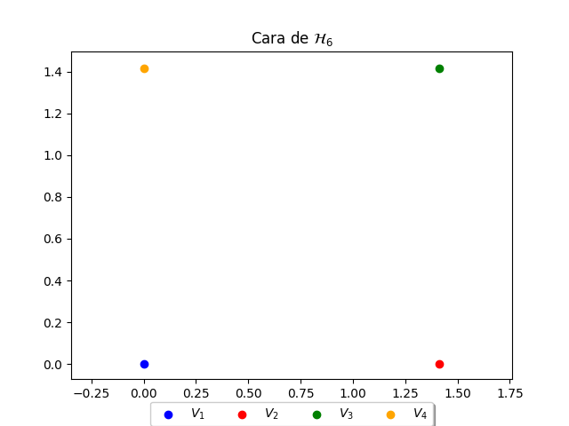

# PoliedreEnUnHiperplaDeR4

## Objectiu
L'objectiu d'aquest seminari és aplicar els coneixements adquirits de geometria euclidiana afí per arribar a construir amb cartró un model acurat d'un cert políedre que anomenarem \textit{P} del qual coneixem les coordenades dels seus vèrtexs.

## Motivació
**P** és un poliedre convex de **R^3** qu té 14 vèrtexs i 9 cares. Coneixem les coordenades dels vertexs com a punts d'un hiperplà de **R^4**. El motiu de donar les coordenades a **R^4** és que, com passa moltes vegades (pensem, per exemple, en el triangle equilàter o el tetràedre regular), podem trobar coordenades més senzilles en una dimensió superior a la necessària. En aquest ca concret, és possible donar coordenades enteres per als vèrtex de **P**.

## Dades del poliedre
### Hiperplans de les cares
|**H_i**|**Equacions dels hiperplans de R^4**|
|-------|---------------------|
|H_1|3x+-1y+-1z+-1t+6= 0|
|H_2|-1x+3y+-1z+-1t+6= 0|
|H_3|-1x+-1y+3z+-1t+6= 0|
|H_4|-1x+-1y+-1z+3t+6= 0|
|H_5|1x+1y+-1z+-1t+4= 0|
|H_6|-1x+1y+1z+-1t+4= 0|
|H_7|-1x+-1y+1z+1t+4= 0|
|H_8|1x+1y+1z+-3t+6= 0|
|H_9|-3x+1y+1z+1t+6= 0|

### Vèrtexs 
|**V_i**|**coordenades a R^4**|
|-------|---------------------|
|V_1|(4,1,2,3)|
|V_2|(3,1,2,4)|
|V_3|(3,2,1,4)|
|V_4|(4,2,1,3)|
|V_5|(1,4,1,4)|
|V_6|(1,6,1,2)|
|V_7|(1,6,2,1)|
|V_8|(1,2,6,1)|
|V_9|(2,1,6,1)|
|V_10|(4,1,4,1)|
|V_11|(2,1,3,4)|
|V_12|(1,2,3,4)|
|V_13|(4,3,2,1)|
|V_14|(4,3,1,2)|

### Equació del Hiperplà
|**H**|**x+y+z+t=10**|
|---|---|

## Resultats
### Imatges de les cares del poliedre

### Imatge per imprimir

### Imatge Construcció Final

